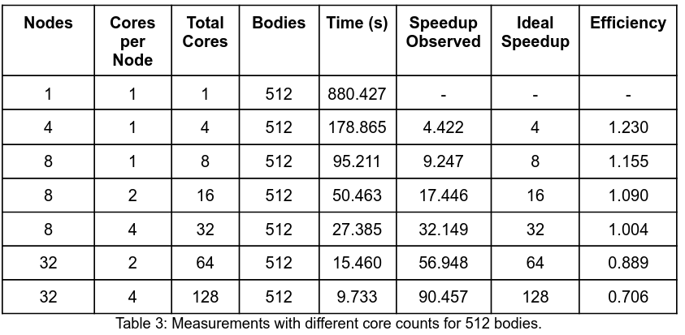

# Parallel-N-body-simulation-in-C
Parallel and sequential n-body simulation program in C, with performance benchmarks.  
## N-body problem
The N-body problem is simply to compute the trajectory of objects in space as
driven by gravitational forces. You can find more details about the problem here:
https://en.wikipedia.org/wiki/N-body_simulation

## To run the program locally:
Sequential:
- compile with `make`.  
- Run `nbody/nbody-seq 32 2 nbody.ppm 1000000`.  
This means that there are 32 bodies, 1000000 iterations, the PPM output is done by
mapping nbody.ppm (and is sized by that file’s initial content), and the PPM file is
updated every 2 seconds. For details about the PPM format, see here: https://en.wikipedia.org/wiki/Netpbm  
- Optionally, to see how the bodies interact, open another terminal while the program is running and use `display -update 2 nbody.ppm` the above command simply says to keep refreshing the display every 2 seconds.

Parallel: 
- compile with `make`
- Run `mpiexec -n 4 nbody/nbody-par`.  
You will need the MPI library for C. `-n` specifies the number of cores to run the program on.

## Performance

